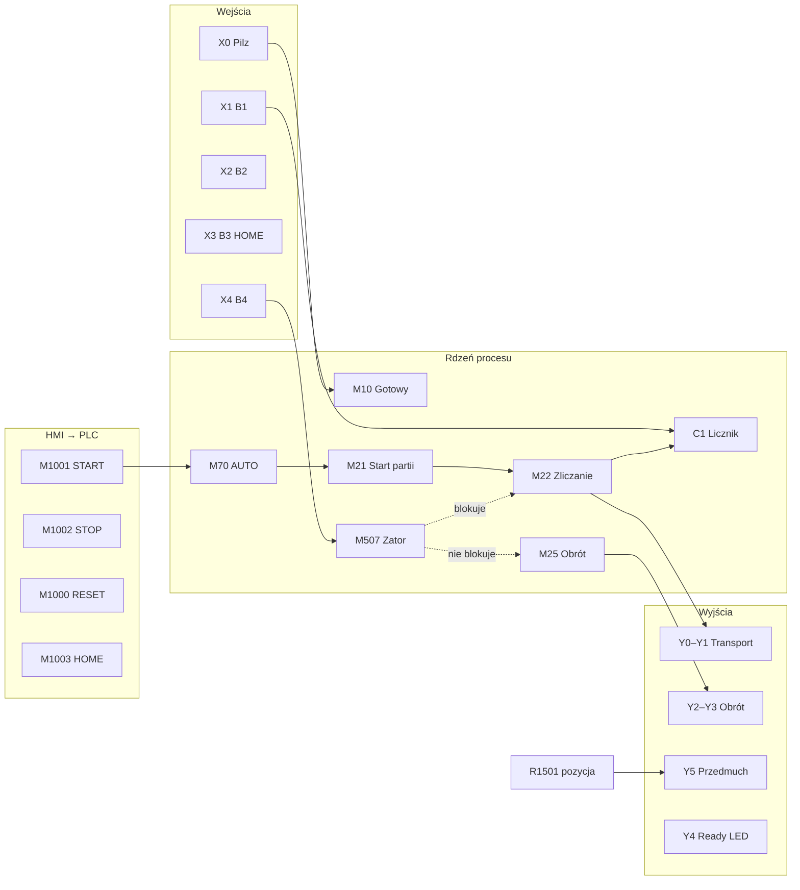
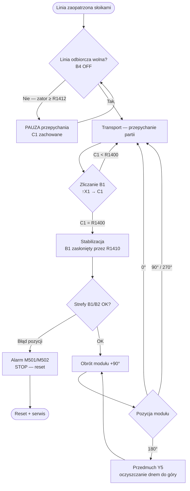
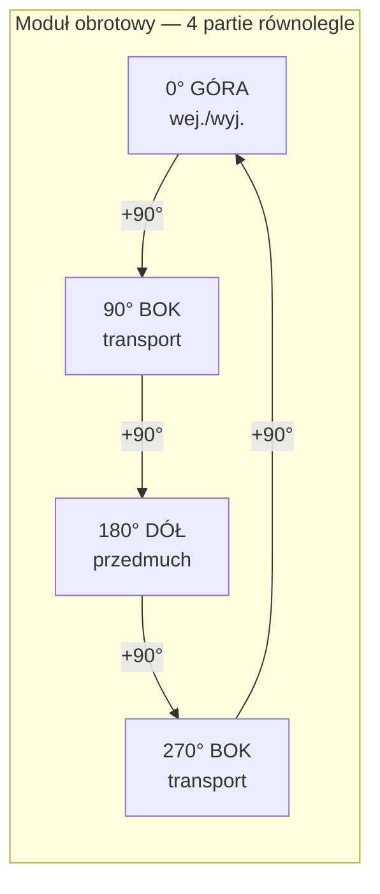
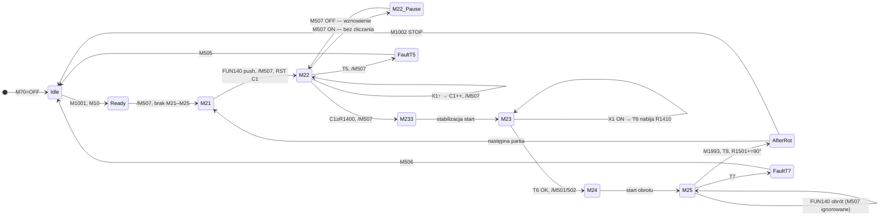
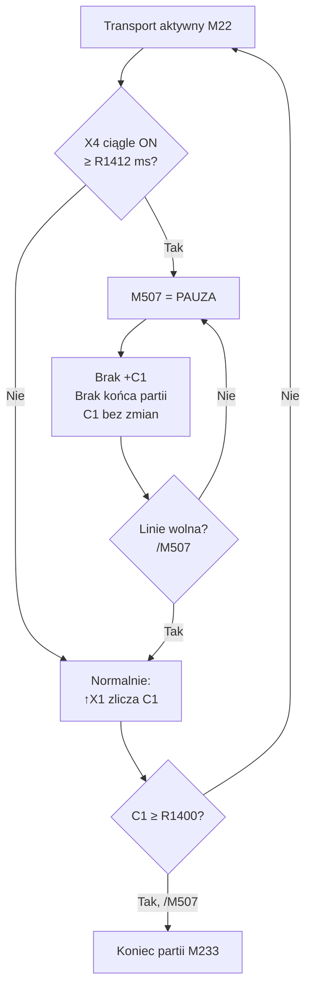
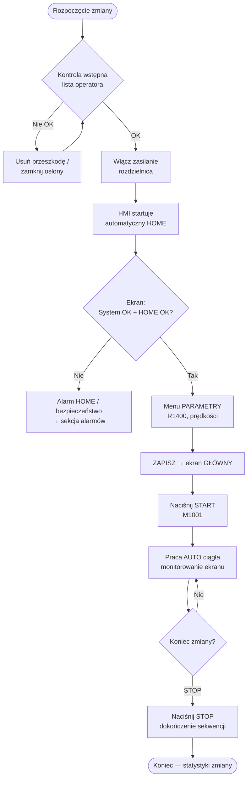
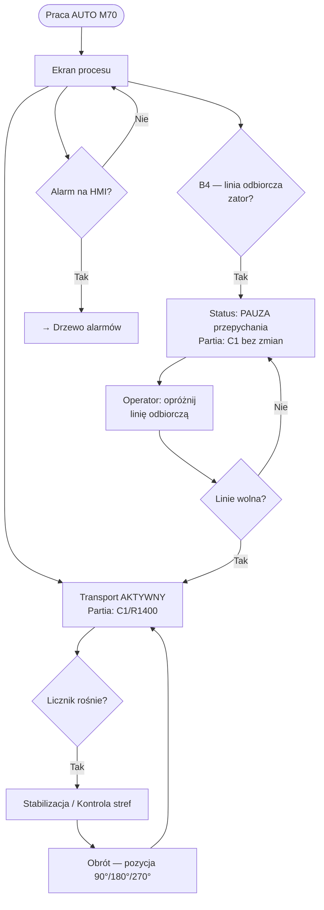
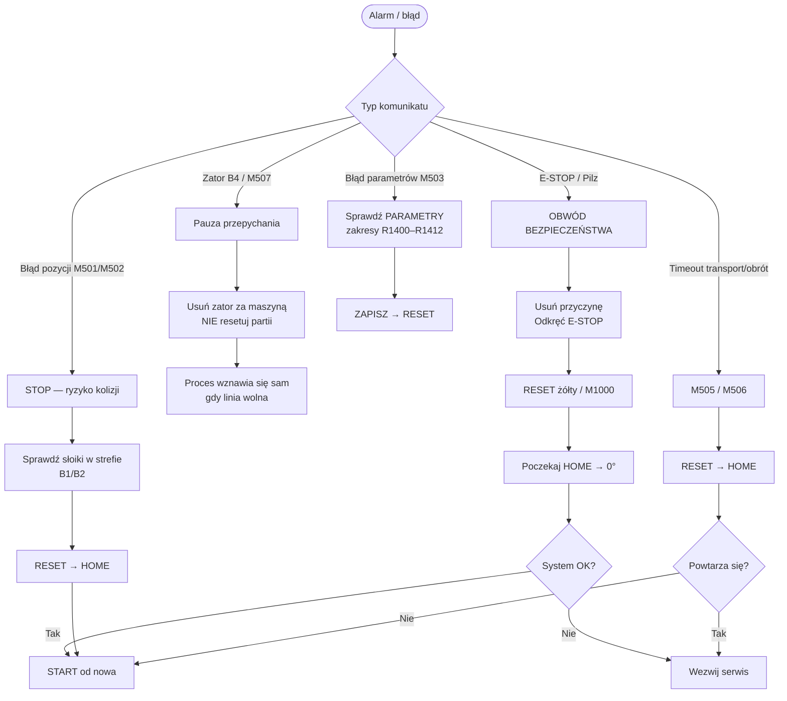
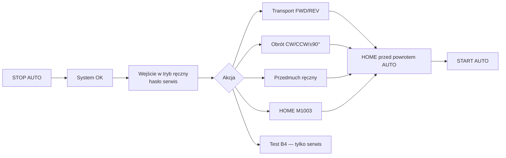

# Vertino — mapy programu, procesu i operatora

**Maszyna:** Vertino — Stacja oczyszczania opakowań

| Sekcja | Opisuje |
|--------|---------|
| **§1 Mapa programu (drzewo N0000–N0034)** | Program **docelowy** — **nie** w sterowniku |
| **§2–3 Proces i operator** | Proces na maszynie (zgodny z oboma wersjami tam, gdzie nie zaznaczono inaczej) |

**W sterowniku dziś:** 78 sieci — **[plc/STAN_FAKTYCZNY.md](plc/STAN_FAKTYCZNY.md)**  
**Plan PLC:** [plc/03_program_vertino_sieci.md](plc/03_program_vertino_sieci.md)

---

## §1 — Program docelowy (plan, 35 sieci)

> Nie mylić z programem w `SKO-Program.pdw` (78 sieci).

---

## 1. Mapa programu PLC

### 1.1 Drzewo modułów (sieci)

```mermaid
flowchart TB
    subgraph ROOT["Main_unit1 — Vertino Program"]
        direction TB

        subgraph L0["Warstwa 0 — Bezpieczeństwo i gotowość"]
            N00[N0000–N0001 Pilz X0 → M1]
            N02[N0002 Reset HMI M1000 → M200]
            N03[N0003–N0004 System gotowy M10]
            N05[N0005 Kasowanie błędów M501–M507]
        end

        subgraph L1["Warstwa 1 — Konfiguracja"]
            N06[N0006 Walidacja R1400–R1412]
            N07[N0007 FUN141 parametry osi]
            N08[N0008 B4 → T52 → M507 ★]
        end

        subgraph L2["Warstwa 2 — Sterowanie trybem"]
            N09[N0009 START/STOP AUTO M70]
            N10[N0010–N0011 HOME M80→M82]
        end

        subgraph L3["Warstwa 3 — Napędy"]
            N12[N0012 FUN140 Transport R1100]
            N13[N0013 FUN140 Obrót R1200]
            N14[N0014 Y4 SYSTEM_READY]
        end

        subgraph L4["Warstwa 4 — Sekwencer AUTO ★"]
            N15[N0015 Start partii M21]
            N16[N0016 Wejście M22 RST C1 T5]
            N17[N0017 Zliczanie ↑X1 → C1]
            N18[N0018 Koniec partii M233]
            N19[N0019 Stabilizacja M23]
            N20[N0020 B1/B2 czas R1410]
            N21[N0021 Start obrotu M25]
            N22[N0022 Koniec obrotu R1501]
        end

        subgraph L5["Warstwa 5 — Proces pomocniczy"]
            N23[N0023 Przedmuch AUTO Y5 @180°]
            N24[N0024 Przedmuch ręczny]
            N25[N0025 Pauza serwo przy M507]
            N26[N0026 Timeout transportu T5]
            N27[N0027 Timeout obrotu T7]
            N28[N0028 Czas cyklu R1500]
        end

        subgraph L6["Warstwa 6 — Serwis"]
            N29[N0029–N0031 Tryb ręczny M100]
            N32[N0032 Symulacja B4 M1050]
            N33[N0033 Licznik zatorów D204]
        end

        N34[N0034 END]
    end

    L0 --> L1 --> L2 --> L3 --> L4
    L4 --> L5 --> L6 --> N34
```



★ — kluczowe dla B4 / licznika C1

### 1.2 Tabela mapy sieci

| Blok | Sieci | Funkcja | Kluczowe sygnały |
|------|-------|---------|------------------|
| Bezpieczeństwo | N0000–N0001 | Pilz | X0 → M1 |
| Gotowość | N0002–N0005 | M10, reset | M1000, M200, M503–M506 |
| Parametry | N0006–N0007 | Walidacja, serwo | R1400–R1412, FUN141 |
| **B4** | **N0008** | Zator potwierdzony | X4, T52, **M507**, R1507 |
| AUTO on/off | N0009 | Praca ciągła | M1001→M70, M1002 |
| HOME | N0010–N0011 | Referencja 0° | M80, M82, X3, T10 |
| FUN140 | N0012–N0014 | Transport, obrót | M1992, M1993, Y4 |
| **Sekwencer** | **N0015–N0022** | Partia M21→M25 | **C1**, M22–M25, M233 |
| Przedmuch | N0023–N0024 | Y5 | R1501=180, M240 |
| Timeouty | N0025–N0028 | T5, T7, R1500 | M505, M506 |
| Ręczny | N0029–N0032 | HMI serwis | M100, M1010–M1024 |
| Diagnostyka B4 | N0033 | Statystyka | D204, M520 |

### 1.3 Mapa zależności sygnałów (skrót)



### 1.4 Kolejność skanu (kolejka wykonania)

```
Skan PLC (góra → dół):
  N0008 ustawia M507
       ↓
  N0009 sprawdza M70
       ↓
  N0012–N0013 FUN140 (reaguje na M21, M25, /M507)
       ↓
  N0015–N0022 sekwencer (czyta M507, aktualizuje C1, M22…M25)
       ↓
  N0026 timeout T5 (tylko gdy /M507)
```

---

## 2. Drzewo procesu

### 2.1 Proces technologiczny (maszyna)



### 2.2 Proces równoległy — moduł 4×90°



| Pozycja R1501 | Funkcja | Akcja procesowa |
|---------------|---------|-----------------|
| 0° | Góra | Wejście partii / wypychanie oczyszczonych |
| 90° | Bok | Transport międzypozycyjny |
| 180° | Dół | **Przedmuch** (Y5) |
| 270° | Bok | Transport międzypozycyjny |

### 2.3 Drzewo stanów PLC (sekwencer AUTO)



### 2.4 Drzewo decyzji — B4 i licznik C1



---

## 3. Drzewo przepływu operatora

### 3.1 Przepływ główny (od włączenia do pracy)



### 3.2 Przepływ podczas pracy AUTO (ekran operatora)



### 3.3 Drzewo alarmów i reakcji operatora



### 3.4 Przepływ — tryb ręczny (skrót, serwis)



### 3.5 Tabela: ekran HMI → akcja operatora → PLC

| Ekran / przycisk | Operator robi | PLC (Vertino) |
|------------------|---------------|---------------|
| GŁÓWNY — START | Start produkcji | M1001 → M70 |
| GŁÓWNY — STOP | Koniec / pauza zmiany | M1002 → RST M70 |
| RESET (żółty) | Po alarmie | M1000 → M200 → N0005 |
| PARAMETRY | Ustawia R1400…R1412 | Walidacja N0006 |
| HOME | Referencja | M1003 → M80 → N0011 |
| Partia C1/R1400 | Obserwacja | C1, R1400 |
| Pozycja modułu | Obserwacja | R1501 (0/90/180/270) |
| Status B4 / zator | Czeka, opróżnia linię | M507, R1507 |
| Tryb ręczny | Serwis | M100, M1010–M1024 |

---

## Powiązane dokumenty

| Dokument | Zawartość |
|----------|-----------|
| [plc/03_program_vertino_sieci.md](plc/03_program_vertino_sieci.md) | Pełna specyfikacja 35 sieci |
| [maszyna.md](maszyna.md) | Opis urządzenia, cykl 360° |
| [operator.md](operator.md) | Instrukcja krok po kroku |
| [plc/mapowanie.md](mapowanie.md) | Mapowanie I/O |
| [receptury.md](receptury.md) | Profile średnic |

---

**© CNC Solutions — Vertino**
