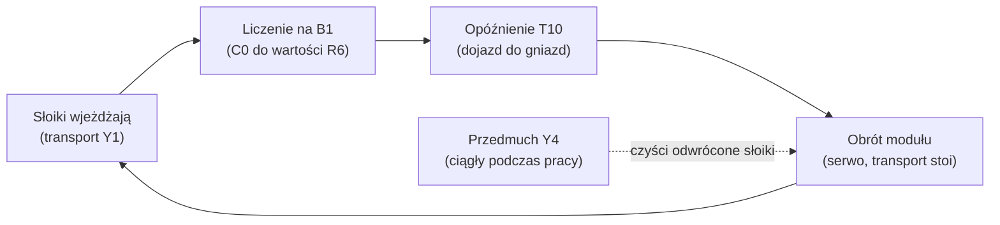

# Stacja kontroli opakowań — opis maszyny

**Zastosowanie:** maszyna do oczyszczania opakowań szklanych przedmuchem
pneumatycznym przed napełnieniem (linia farmaceutyczna).
**Sterownik:** FATEK HB1-14MBJ25 | **Panel:** FATEK P2043NA/P2043EA (4.3")
**Bezpieczeństwo:** przekaźnik Pilz PNOZ X7 24VAC/DC (774059, wg schematu)

| | |
|---|---|
|  |  |

Rendery CAD: [media/unnamed.png](<../media/unnamed.png>) (izometria),
[media/unnamed (1).png](<../media/unnamed (1).png>) (widok z góry),
[media/unnamed (2).png](<../media/unnamed (2).png>) (widok z boku).
Film z linii: [media/VID_20251104_132106 (1).mp4](<../media/VID_20251104_132106 (1).mp4>).

---

## Budowa

1. **Tor transportowy** — słoiki wjeżdżają w rzędzie z linii (przed stacją stół
   obrotowy SOB-11), prowadzone między napędzanymi elementami transportu.
   Napędy załączane wyjściem **Y1** (silniki krokowe ze sterownikami SH-D08R —
   karta katalogowa: [referencje/napedy/SH-D08R.pdf](../referencje/napedy/SH-D08R.pdf)).
2. **Moduł obrotowy (odwracający)** — dwie tarcze z gniazdami na słoiki, napęd
   step-servo iCAN 57BLF-1830NBB (188 W, z enkoderem) ze sterownikiem SS86D,
   przekładnia 10:1, sterowany impulsowo z PLC (PSO1: Y2/Y3).
   Każda partia = **obrót o 90°**; po dwóch krokach słoiki są odwrócone dnem
   do góry w strefie przedmuchu, po czterech — wracają na tor wyjściowy.
3. **Przedmuch** — zawór pneumatyczny **Y4** podaje powietrze w strefie modułu;
   odwrócone słoiki są przedmuchiwane (zanieczyszczenia wypadają w dół).
4. **Czujniki:**
   - **B1 (X1)** — liczenie słoików wjeżdżających do modułu,
   - **B2 (X2)** — czujnik bazowania modułu (DOG serwo),
   - **B3 (X3)** — czujnik na wyjściu: mierzy czas zasłonięcia przez przechodzący słoik; zasłonięty dłużej niż R8 → pauza (linia nie nadąża),
   - **B4** — czujnik osłony (obwód Pilz); **kluczyk:** NC→Pilz, NO→**X4** (przezbrajanie).
5. **Obwód bezpieczeństwa** — E-stop, B4, kluczyk → Pilz PNOZ X7, RESET S2, **X0** do PLC.
   - **Produkcja (X4=OFF):** osłona zamknięta; ekran **BS3** — serwis (**R14**).
   - **Przezbrajanie (X4=ON):** bypass B4; ekran **BS6** — **R11**, obrót ±90°, jog.
   E-stop aktywny w obu pozycjach klucza.

Schemat elektryczny: [schemat_elektryczny/SKO.pdf](../schemat_elektryczny/SKO.pdf).

---

## Cykl pracy (automat)

1. Transport (Y1) podaje słoiki; czujnik B1 zlicza sztuki (licznik C0).
2. Po zliczeniu **R6** sztuk transport jedzie jeszcze przez czas **T10 = R7 × 0.01 s**,
   żeby ostatni słoik doszedł do gniazda modułu.
3. Transport staje, moduł wykonuje obrót (program serwo ROTATE) — partia
   odwraca się pod przedmuch, wcześniej oczyszczone słoiki wracają na tor.
4. Cykl wraca do liczenia. Przedmuch (Y4) działa ciągle podczas pracy.

**Pauza B3:** czujnik B3 na wyjściu jest zasłonięty przez każdy przechodzący słoik.
Nastawa **R8 × 0,01 s** to czas, jaki pojedynczy słoik może zajmować czujnik
przy normalnym przepływie. Gdy B3 pozostaje zasłonięty **dłużej** — linia odbiorcza
nie nadąża (lub jest zator) — transport i przedmuch stają do czasu zwolnienia toru.
Liczenie nie jest tracone — C0 zachowuje wartość.

**Stany maszyny i pełna logika:** [plc/program.md](plc/program.md).

---

## Dane procesowe

| Parametr | Adres | Znaczenie |
|----------|-------|-----------|
| Ilość sztuk w partii | R6 | Liczba słoików kompletowana przed obrotem; **ustawiana operatora na BS1** (klik w wartość celu) |
| Opóźnienie po partii | R7 | × 0.01 s |
| Czas przejazdu słoika przy B3 | R8 | × 0.01 s — próg zasłonięcia czujnika przez jeden słoik |
| Licznik bieżący | C0 (kopia w R100) | Zerowany przy każdym wejściu w liczenie |

Średnice obsługiwanych słoików: [srednice_slokow.txt](srednice_slokow.txt).

---

**© CNC Solutions — Michał Batorowicz**
