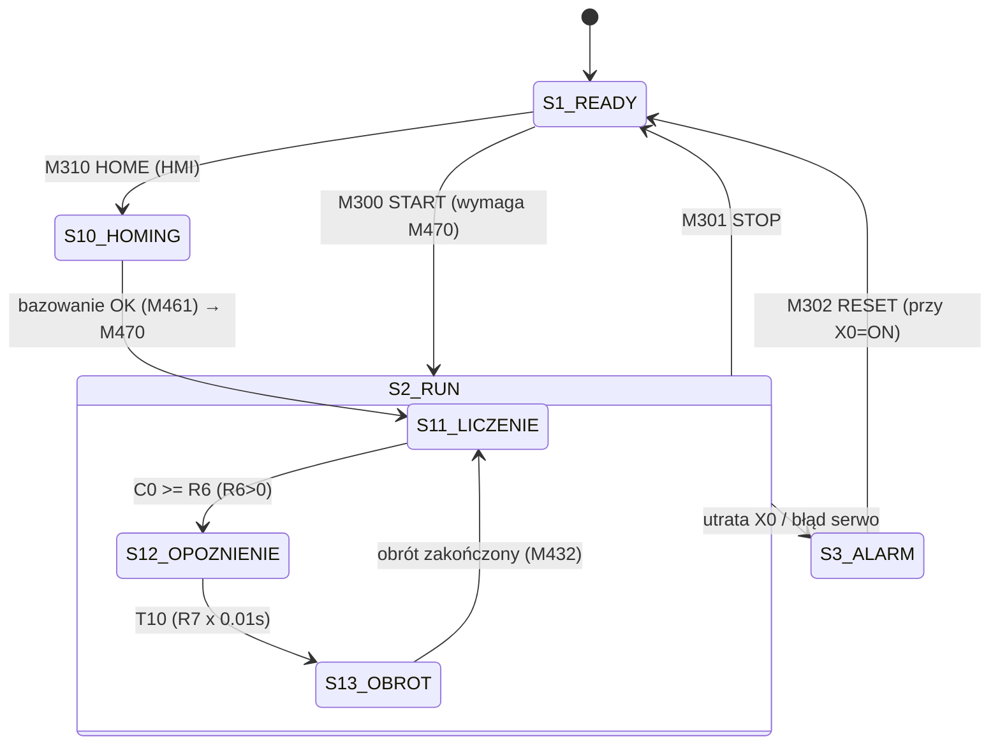

# Program PLC — opis sieci

**Sterownik:** FATEK HB1-14MBJ25 | **Jednostka programowa:** `Main_unit1`
**Źródło:** wydruk [plc/SKO-Program.pdf](../../plc/SKO-Program.pdf) (drabinka + mnemonika), stan z 2026-06.
**Zakres:** 31 sieci N0000–N0030 (N0031–N0032 puste).

Program jest maszyną stanów zbudowaną na przekaźnikach krokowych S (Step Relay).
Mapa rejestrów i symboli: [mapa_io.md](mapa_io.md). Konfiguracja serwo: [serwo.md](serwo.md).

---

## Stany maszyny

| Krok | Nazwa | Znaczenie |
|------|-------|-----------|
| S1 | READY | Gotowość — bezpieczeństwo OK, maszyna zatrzymana |
| S2 | RUN | Praca automatyczna (nadrzędny dla S10–S13) |
| S3 | ALARM | Błąd — kasuje wszystkie kroki i licznik C0 |
| S10 | HOMING | Bazowanie serwo modułu obrotowego |
| S11 | LICZENIE | Transport słoików + zliczanie na B1 do wartości R6 |
| S12 | OPÓŹNIENIE | Odczekanie T10 (nastawa R7) po skompletowaniu partii |
| S13 | OBRÓT | Obrót modułu (serwo, tabela R1400), transport stoi |

---

## Sieci N0000–N0006 — bezpieczeństwo i sterowanie stanami

### N0000 — Alarm przy utracie bezpieczeństwa
`/X0 → SET S3`
Zanik sygnału z przekaźnika Pilz PNOZ X7 (X0) natychmiast ustawia ALARM.

### N0001 — Skutki alarmu
`S3 → RST S1, RST S2, RST S10, RST S11, RST S12, RST S13, RST C0`
ALARM kasuje wszystkie kroki oraz licznik sztuk C0 (partia w toku jest tracona).

### N0002 — START
`M300↑ · X0 · /S3 · M470 → SET S2`
Start pracy (zbocze narastające M300 z HMI) możliwy tylko przy aktywnym bezpieczeństwie,
braku alarmu i wykonanym bazowaniu (M470 HOME_OK).

### N0003 — STOP
`M301 + /X0 + S3 → RST S2, RST S10, RST S11, RST S12, RST S13`
Zatrzymanie: przycisk STOP z HMI, utrata bezpieczeństwa lub alarm.

### N0004 — READY set
`X0 · /S2 · /S3 → SET S1`

### N0005 — READY reset
`/X0 + S2 + S3 → RST S1`

### N0006 — Kasowanie alarmu
`S3 · M302 · X0 → RST S3`
RESET z HMI skuteczny tylko przy przywróconym bezpieczeństwie.
Po skasowaniu S3 maszyna wraca do S1 (N0004). Uwaga: M470 pozostaje ustawione —
ponowne bazowanie po alarmie nie jest wymuszane przez program.

---

## Sieci N0007–N0011 — zezwolenia i blokada B3

### N0007 — Master enable
`S2 · X0 → M400 (M_EN)`

### N0008 — Zezwolenie przepływu
`M400 · /M403 → M401 (M_EN_FLOW)`

### N0009 — Zawór przedmuchu
`M400 · /M403 · M421 → Y4`
Przedmuch działa ciągle podczas pracy, o ile: brak blokady B3 (M403)
i włączone zezwolenie M421 z HMI.

### N0010 — Filtr czujnika B3
`M400 · X3 → T30 (baza 0.01 s, nastawa R8)`

### N0011 — Blokada B3
`M400 · X3 · T30 → M403 (B3_BLOCK)`
Gdy czujnik B3 (X3) jest zasłonięty dłużej niż R8 × 0.01 s — spiętrzenie słoików
na wyjściu — aktywuje się blokada M403: zatrzymuje transport (przez M401→M410)
i zamyka zawór przedmuchu Y4. Po odsłonięciu B3 blokada zwalnia się samoczynnie.

---

## Sieci N0012–N0020 — bazowanie (HOMING)

### N0012 — Start bazowania
`S1 · X0 · M310↑ → SET S10`
Bazowanie uruchamiane przyciskiem HOME z HMI, tylko w stanie READY.

### N0013 — Wejście w cykl
`S2 · /S10 · /S11 · /S12 · /S13 · M470 → SET S11`
Po starcie (S2) i przy braku aktywnego podkroku program wchodzi w LICZENIE.
Tu również wraca cykl po zakończonym obrocie (S13 kasowane w N0029).

### N0014 — Inicjalizacja kroku LICZENIE
`S11↑ → RST S10, RST S12, RST S13, RST C0, RST T10`
Każde wejście w S11 zeruje licznik sztuk C0 i timer opóźnienia.

### N0015 — Zapis parametrów serwo (FUN141 MPARA)
`(M1924 + M305↑) · /M431 · /M460 → FUN141 MPARA Ps:1, SR:R1200 ; FO0 → M468`
Parametry osi (tabela R1200) ładowane przy pierwszym skanie (M1924) lub na żądanie
z HMI (M305), ale nie podczas ruchu osi (M431 — obrót aktywny, M460 — bazowanie aktywne).
Błąd zapisu → M468.

### N0016 — Alarm parametrów
`M468 → SET S3`

### N0017 — Wykonanie bazowania (FUN140 HSPSO)
`S10 → FUN140 HSPSO Ps:1, SR:R1300 (Prog HOME), WR:R1500`
`PAU = S3 + /X0` | wyjścia: `ACT → M460`, `ERR → M462`, `DN → M461`
Program serwo R1300: najazd na punkt zerowy (DRVZ), potem pozycja absolutna 0
([serwo.md](serwo.md)). Alarm lub utrata X0 pauzuje ruch.

### N0018 — Zerowanie pozycji
`M461↑ → MOV 0 → R1501`

### N0019 — Błąd bazowania
`M462 → SET S3, RST S10`

### N0020 — Bazowanie zakończone
`M461 → SET M470 (HOME_OK), SET S11, RST S10`
Uwaga: po bazowaniu z READY program ustawia S11, ale transport ruszy dopiero
po starcie (S2 → M400 → M401), bo M410 wymaga M401.

---

## Sieci N0021–N0027 — transport, liczenie, opóźnienie

### N0021 — Zezwolenie transportu
`(S11 + S12) · M401 → M410`
Transport pracuje w krokach LICZENIE i OPÓŹNIENIE; staje podczas OBROTU
oraz przy blokadzie B3.

### N0022 — Napęd transportu
`M410 → Y1`

### N0023 — Zliczanie sztuk
`S11 · M410 · X1↓ · M420 → (+1) C0`
Licznik C0 zwiększany na zboczu opadającym czujnika B1 (X1) — słoik opuszcza
strefę czujnika. Wymaga zezwolenia liczenia M420 z HMI. Zliczanie tylko
w kroku S11 i przy jadącym transporcie (M410).

### N0024 — Podgląd licznika
`S11 → MOV C0 → R100`
Kopia C0 do rejestru R100 (odczyt dla HMI).

### N0025 — Komplet partii
`S11 · (R6 > 0) · (C0 >= R6) → SET S12, RST S11`
Po zliczeniu R6 sztuk przejście do OPÓŹNIENIA. Zabezpieczenie: przy R6 = 0
przejście nie następuje (transport pracowałby bez końca — patrz uwagi niżej).

### N0026 — Timer opóźnienia
`S12 · M400 → T10 (baza 0.01 s, nastawa R7)`
Czas na dojechanie ostatniego słoika z czujnika B1 do gniazda modułu.
Timer liczy tylko przy M400 (zatrzymuje się przy STOP/alarmie).

### N0027 — Koniec opóźnienia
`S12 · T10 → SET S13, RST S12`

---

## Sieci N0028–N0030 — obrót modułu

### N0028 — Wykonanie obrotu (FUN140 HSPSO)
`S13 → FUN140 HSPSO Ps:1, SR:R1400 (Prog ROTATE), WR:R1510`
`PAU = /X0 + S3` | wyjścia: `ACT → M431`, `ERR → M433`, `DN → M432`
Program serwo R1400: ruch względny −25000 impulsów z prędkością 9000
([serwo.md](serwo.md)). Moduł odwraca słoiki (pełna partia trafia pod przedmuch,
oczyszczone wracają na linię).

### N0029 — Obrót zakończony
`M432↑ → MOV 0 → R1511, RST S13`
Po skasowaniu S13 sieć N0013 ponownie ustawia S11 — cykl trwa.

### N0030 — Błąd obrotu
`M433 → SET S3`

### N0031–N0032 — puste (ORG OPEN)

---

## Mnemonika (kompletna)

Pełna mnemonika znajduje się w wydruku [SKO-Program.pdf](../../plc/SKO-Program.pdf)
(strony 6–9, kroki 00000M–00156M). Eksporty z WinProLadder:
[plc/export/ladder.ldr](../../plc/export/ladder.ldr), [plc/export/comment.txt](../../plc/export/comment.txt),
[plc/export/tabele.tab](../../plc/export/tabele.tab).

---

## Uwagi i potencjalne ryzyka (do rozważenia przy rozbudowie)

> Propozycja usunięcia poniższych ryzyk wraz z rozbudową programu (tryb
> serwisowy, nastawy serwo z HMI, statystyki): [propozycja_rozbudowy.md](propozycja_rozbudowy.md).

| # | Obserwacja | Skutek |
|---|------------|--------|
| 1 | Brak timeoutu bazowania i obrotu | Przy awarii napędu/czujnika DOG maszyna wisi w S10/S13 bez alarmu; FUN140 pauzowane tylko przez S3//X0 |
| 2 | Alarm (N0001) zeruje C0 | Partia w toku jest tracona — po alarmie liczenie zaczyna się od zera, choć słoiki fizycznie są już za B1 |
| 3 | M470 nieusuwane po alarmie | Po alarmie wywołanym błędem serwo (M462/M433) można wystartować bez ponownego bazowania |
| 4 | R6 = 0 → transport bez przejścia do obrotu | Zabezpieczone tylko warunkiem R6>0 w N0025; brak walidacji zakresu R6/R7/R8 |
| 5 | Brak liczników statystycznych | Stare rejestry D100/D200–D204 nie są już obsługiwane |
| 6 | X2/X4/Y5 niepodłączone w drabince | X2 pełni rolę wejścia DOG serwo (konfiguracja tabeli parametrów, nie drabinki) |

---

**© CNC Solutions — Michał Batorowicz**
